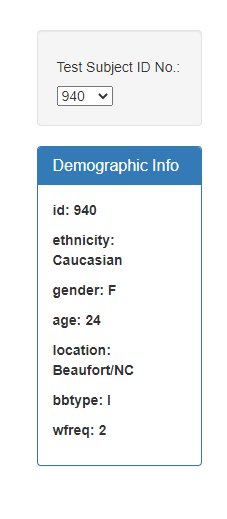
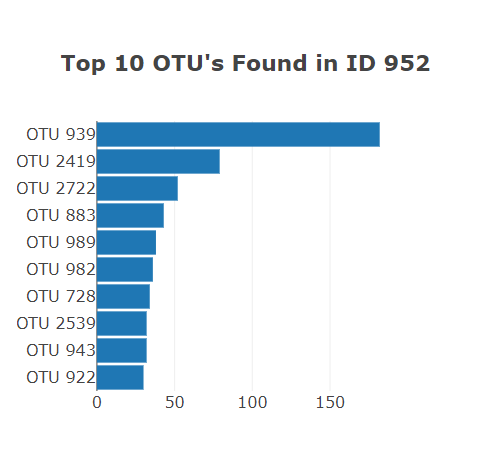
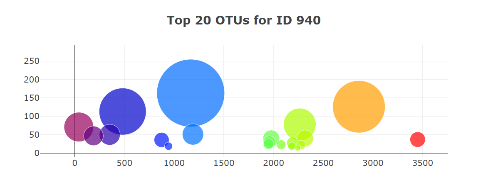
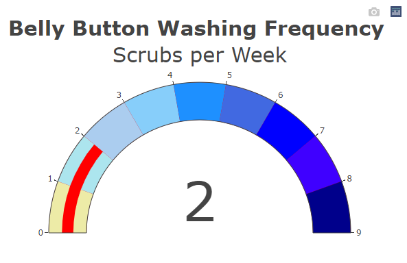

# **belly-button-challenge**
## Module 14 Challenge for UCI Data Analytics Bootcamp

# **Introduction**
This challenge required the building of an interactive dashboard that would populate a number of graphs illustrating the diversity of microorganisms residing in the belly button of the selected test subject. The test subject is chosen using a dropdown menu of samples in the dataset. Once the subject is chosen, the metadata for that subject is used to populate a panel-box with the demographic information for that subject. There are three graphs on the dashboard, as follows:

* Bar chart of the top ten microbial species, referred to as operational taxonomic units (OTU).
* Scatterplot of the microbial samples collected.
* Indicator gauge that illustrates the washing frequency for the selected test subject.

Completed challenge reflected on GitHub Page:  https://prabharsh.github.io/belly_button_challenge/

# **Files**

In the repository are the completed challenge files.

* *README.md* - ReadMe file for the project.
* *index.html* is the html file for the challenge.
* *samples.json* is the data file. Note: This file is not used directly since an API call is made to populate the data instead.
* *js* Folder - This folder contains the *app.js* file which is the JavaScript code that updates the html file.
    * This folder also contains a *bonus.js* file. This file is not used, but prevents an error in the html file.
* *output* Folder - This folder contains image files from the html output that are used in this ReadMe.

# **Results**

All charts including the bonus gauge were successfully created (not without much frustration.)

First, the demographic chart populates with the metadata. I selected the sample-metadata id using d3 and created an object with each key and value that are then used to populate the box. I included this code within my chartBuilder function instead of creating a separate function.

Created this chart using the slice and reverse functions.

Using Colorscale attribute helped create different color schemes.

inal output with color attributed saved

Dashboard final output released under 

https://prabharsh.github.io/belly_button_challenge/

